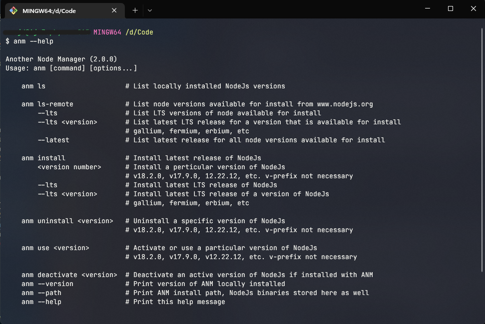

# Another Node Manager


A simple and lightweight alternative to
[Node Version Manager](https://github.com/nvm-sh/nvm) (nvm) for Linux and [NVM for Windows](https://github.com/coreybutler/nvm-windows). Supported architectures armv6l, armv7l, arm64, amd64 (x86_64) for Linux and x64 on Windows. macOS support will be added shortly.

> Wanted something to setup my SBC server projects without the overhead of nvm, and I had issues with NVM for Windows.

Works on Windows, Debian, Fedora, and Arch based systems. Testing being conducted on Windows 11, Ubuntu, Fedora, and Manjaro. Only tested using git-bash on Windows. Launching in Powershell will spawn a git-bash subprocess.
- Test Systems:
   - X86_64 PC: Windows11, Ubuntu 20.04 and 22.04, Fedora 36 and Manjaro
   - Raspberry PI 3B, 4B: Raspberry Pi OS, Ubuntu, Manjaro
   - Rock64, RockPro64: Armbian, Manjaro
   - Pinebook Pro: Manjaro

- Compatibility for Linux:
   - Node v0.8.6+ (x86, x86_64)
   - Node v4.0.0+ (armv6l, armv7l, arm64)

### Before Installing
1. For Windows: this utility cannot install dependencies for windows. These will have to be installed manually.
   - Please install [`python`](https://www.python.org/) version 3.8 or higher
   - And, [`git-scm`](https://git-scm.com/) for windows (for `git-bash`), or `cygwin`. Does not work in PowerShell.
   - Enable developer mode in Windows settings. This lets you make symbolic links (`mklink`) without admin privilege.
  
2. For Linux: this utility will check and automatically install all dependencies: python, pip, git, curl and wget.

## Install
1. Install to default user-space (for Windows and Linux). This should install to `/home/$USER/.anm`
   ```
   curl -o- https://raw.githubusercontent.com/anujdatar/anm/main/install.sh | bash
    ```
   ```
   wget -qO- https://raw.githubusercontent.com/anujdatar/anm/main/install.sh | bash
   ```
   > For Windows: launch in git-bash for best results and use the `curl` version, git bash does not have wget.

2. Install ANM system-wide, for all users. This should install to /opt/anm. Use the following:
   ```
   curl -o- https://raw.githubusercontent.com/anujdatar/anm/main/install.sh | bash -s system
   ```
   ```
   wget -qO- https://raw.githubusercontent.com/anujdatar/anm/main/install.sh | bash -s system
   ```
   > NOTE: For Linux only. And, most ANM actions, and `npm install -g` will require `sudo` privileges.

3. Custom location:
   - Clone git repository
   - Make `install.sh` an executable. `chmod +x install.sh`
   - Run the install script. `./install.sh`

4. If you want to use the script without installing, just clone the repository,
install dependencies mentioned above, create files named `installed` and `active`. Make
`anm.sh` and executable file `chmod +x anm.sh`. You should now be able to run
ANM from the directory `./anm.sh ls-remote`, `./anm.sh install --lts`, etc.

## Usage


1. List locally installed node versions / releases. Should tell you active version as well.
   ```
   anm ls
   ```
2. List node versions available for install from www.nodejs.org
   - List all available options
      ```
      anm ls-remote
      ```
   - List all LTS releases
      ```
      anm ls-remote --lts
      ```
   - List latest LTS release for a particular version
      ```
      anm ls-remote --lts <release name>  # gallium, fermium, argon, etc
      ```
   - List latest release of each version
      ```
      anm ls-remote --latest
      ```
3. Install a version of NodeJs
   - Install the latest available release
      ```
      anm install
      ```
   - Install the latest LTS version release
      ```
      anm install --lts
      ```
   - Install the latest release of a specific LTS version
      ```
      anm install --lts <release name>  # gallium, fermium, argon, etc
      ```
   - Install a specific release by version number
      ```
      anm install v16.15.0 # or 18.2.0, v-prefix not necessary
      ```
4. Uninstall an installed version of NodeJs
   ```
   anm uninstall <version number>  # v16.15.0 or 14.19.3, v-prefix not necessary
   ```
5. Use a particular version of NodeJs, if you already have a few installed
   ```
   anm use <version number>  # v16.15.0 or 18.2.0, v-prefix not necessary
   ```
6. Deactivate a currently installed version of NodeJs if managed by ANM
   ```
   anm deactivate <version number>  # v16.15.0 or 18.2.0, v-prefix not necessary
   ```
7. Other misc. commands
   ```
   anm --version    # print version of ANM that is installed
   ```
   ```
   anm --path       # print path where ANM is installed, NodeJs binaries in a subfolder here
   ```
   ```
   anm --help       # print help message
   ```

## More on Installation
The convenience script does the following in case you want to install manually.
   1. Update/upgrade system
   2. Install missing dependencies using your package manager (apt/dnf/pacman) (on Linux only)
    - `curl`, `wget`, `git`, `jq`, `python3`, `python3-pip` (`python-pip` if using Arch). Ironically you need either `curl` or `wget` to get started. 😝
   3. Install `packaging` and `urllib3` using `pip`. `pip install packaging urllib3`
   4. Clone the [ANM git repo](https://github.com/anujdatar/anm) to `$HOME/.anm` (Windows and Linux).
      - `/opt/anm` if Linux-system-wide-installation. This step is skipped if you are installing from the repo-clone.
   5. Makes `anm.sh` an executable (`chmod +x /<path>/anm.sh`). And creates a symlink in `$HOME/.anm/bin`
      - `ln -s $HOME/.anm/anm.sh $HOME/.anm/bin/anm`
      - or `/opt/anm/bin` if system-wide install on Linux
  6. Adds the following to your shell rc profile (`.bashrc`, `.zshrc`, `.profile`). This is required for anm detect install location and work correctly.
      ```bash
      # >>>>>>>> Block added by ANM install >>>>>>>>
      if ! [[ "$PATH" =~ "$install_path/bin" ]]; then
      [ -d "$install_path/bin" ] && export PATH="$install_path/bin:$PATH"
      fi

      if ! [[ "$PATH" =~ "$install_path/versions/current" ]]; then
      [ -d "$install_path/bin" ] && export PATH="$install_path/versions/current:$PATH"
      fi

      if [ -d "$install_path" ]; then export ANM_DIR="$install_path"; fi
      # >>>>>>>>>>>>>> End ANM block >>>>>>>>>>>>>>>
      ```
      - or `/etc/profile.d/anm_profile.sh`, if system-wide installation on Linux
      - Currently `bash` and `zsh` are supported. Other shell users should make sure `$HOME/.profile` and/or `/etc/profile` are loaded when shell is launched.

> **Note**: On Windows, the default installation directory is `C:\Users\<username>\anm` regardless of if you are using `git-bash`
> (which is `mingw` I believe) or if you have `cygwin` installed separately (in `C:\cygwin`). But the rc file that gets
> updated will depend on the terminal emulator you use. If you use `git-bash` your rc file should be
> `C:\Users\<username>\.bashrc` or `C:\Users\<username>\.zshrc`. But if you use `cygwin` you default might be
> `C:\cygwin64\home\<username>\.bashrc` or `C:\cygwin64\home\<username>\.zshrc`. So if you want it to operate in both
> environments, you will have to add the block to the other rc files manually.
>
> In your rc files on `git-bash`/`mingw` you install path should look like `/c/Users/<username>/.anm`.
> Whereas on `cygwin` it should be `/cygdrive/c/Users/<username>/.anm` so the block above may look different and also needs to be that way.
> All installed nodejs versions will be stored in the `/.anm/versions/node/` directory.
> Default`corepack` binary does not seem to work on Windows in `cygwin` at the moment. `crlf` vs `lf` line ending issue. Works in `git-bash` (`mingw`) though.

You might have to restart your system, or logout and log back in, or just close shell and reopen. Depends. You
should be able to use anm from command line after this.

## Uninstall
Unfortunately this has to be manual for now
  1. Remove the installed directory
    ```
    rm -rf /home/$USER/.anm
    ```
  2. Remove the block added by ANM from your RC file (`$HOME/.bashrc` or `$HOME/.zshrc` or `$HOME/.profile`). Or delete `/etc/profile.d/anm_profile.sh` for system-wide installation on Linux

## TODO:
1. Look into aliasing installed node versions
2. Add macOS support

## Thanks
Uses some ideas from [NVM](https://github.com/nvm-sh/nvm), but works differently.
Was initially inspired by their work. But when I started this project, I had
issues with NVM on some of my RockChip based SBCs. It works perfectly now, but I
had a few different ideas I wanted to try out for my local servers.

Unlike NVM, ANM does not load it's entire code to the shell profile every time
you launch terminal. But has very limited functionality compared to NVM.
Probably not the most elegant solution, but a learning process for me.
